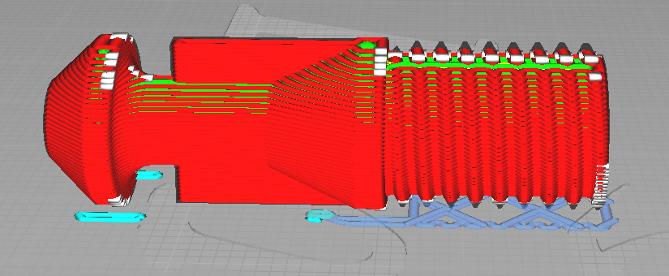

# DON’T RUIN THIS FOR EVERYONE.
Like any toy blaster this one, depending on its appearance & presentation, has the
potential to be mistaken for a real firearm. This blaster must be printed in bright colors
and used responsibly so that it cannot under ANY circumstances be misconstrued for
a deadly weapon. If you fail to build & use this blaster with this in mind you will
jeopardize not only your own life, but also the future of this hobby.

---
# Files licensed under Creative Commons CC BY-NC-SA.
Please visit: https://creativecommons.org/licenses/by-nc-sa/4.0/ for more d.etails

---

## Naming of Parts

### Calibration
Start by Printing the [Plunger](#Plunger) (& [Plunger-Core](#Plunger-Core), if you have no Metall one)
If those Fit fine inside each other it should work fine.

### Plunger

- 2 variations, high & low power.
- 0.15mm layer height
- No supports
- 6 perimeters
- If you can’t thread the aluminum/3D Printed
plunger core into the printed part
you need to recalibrate your
printer

### Plunger-Core

- 2 variations, high & low power.
- 0.15mm layer height
- Add Support
- 100 % Infill

This Orientation is Required, for Strength, else the Plunger Core will Breake more Easily under Tension.

### Frame

- 0.2mm Layer Height
- 6 Perimeters
- 5 Top, 5 Bottom
- 100% infill is ideal
- NO SUPPORT
- NO BRIM (Use one if absolutely necessary but
understand it will require careful clean up with an
Exacto knife)
- Ensure excellent bed adhesion, lift from the bed will
ruin the part. Use an adhesive if necessary
- PETG or PLA+
- Avoid “elephants foot”. If it is present you will need to
clean up the rails with an Exacto knife.

### Slide

- 0.2mm Layer Height
- 6 Perimeters
- 5 Top, 5 Bottom
- 100% infill
- No Supports
- PETG recommended. This part needs to
flex to install the plunger tube.
- Ensure there is no warping: print slowly &
be mindful of how your fan shroud is
oriented.

### Catch & Sear

- 0.2mm Layer height
- 4 perimeters
- 100% infill
- Print with support as shown.
- PLA+ or PETG

### Front

- **PRINT IN HIGH-VIS ORANGE.**
- 0.2mm layer height
- 4 perimeters
- No supports
- 5 top, 5 bottom

### Trigger, Release Guard

- Print the “RIGHT” variations of
GUARD and RELEASE if you are
right handed. Same for left handed.
- 0.2mm layer height (print RELEASE
at 0.1mm layer height for best
resolution)
- 6 perimeters
- Try to do this without a brim. There
will be a lot of cleanup if you need
to use one.

### Rear

- 0.2mm Layer height
- 6 perimeters
- No supports

### Cover

- Just print it.

### Magazin
- 0.1mm Layer Height
- 3 Perimeters
- Supports (Ideally Tree)
- (Brim for adhesion)

Variant A:

Variant B:

Variant B will require you
to sand the magazine well to get
rid of the noise.

