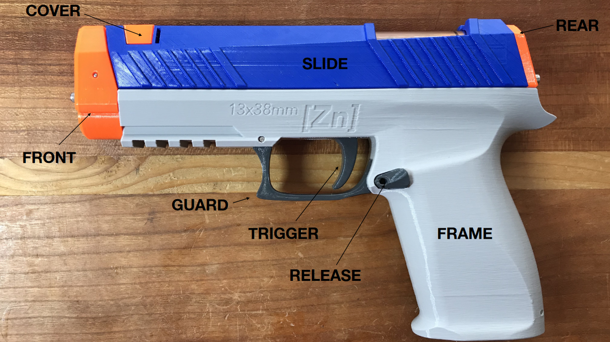

# ZINC

This is a 3D Printed Nerf Gun.
A great Project for Getting in the World of 3D Printing.

# Parts List

## Printed Parts
All Printed Parts are Provided in [Zinc_Files](Zinc_Files/Current/)

## Hardware Kit
Visit https://www.frontlinefoam.com/product/zinc-hardware-kit/ to purchase a hardware kit. 
This will Help Support 118 Design make more Awesome Designs like this.

If you buy this, you are Done with the Parts List.
Its as Easy as this.

Alternativly you can look at the Bill of Materials (BOM) for Metric Parts Provided in the Following Paragraph.

### Is it Worth it?
It is Cheaper too Buy it as Kit and you will Support the original Designer.
Reason beeing that 118 Design can buy it and Bulk and therfore get cheaper Prices.
(Even, with 30€ Additional Shipping Cost it will be Cheaper Trust me i tried it ;)
Additonally you will Safe yourself a **lot** of Trouble and Time Sourcing the Hardware.

You have been Warned.

A Bill of Materials (BOM) for Metric Parts is provided [here](BOM_Metric.md).

## 118 Design
All files licensed under Creative Commons CC BY-NC-SA.
Visit www.118.design for more information.

NOT FOR COMMERCIAL USE
